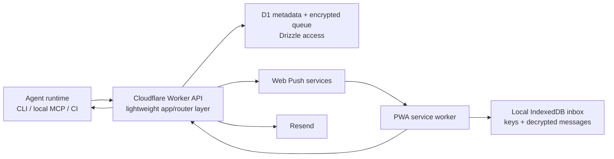

# Agent Notifier Product Spec

Status: product source of truth and implementation reference
Repository: `agent-notifier`
Product name: placeholder
Last updated: 2026-06-30

## 1. Summary

Agent Notifier is an end-to-end encrypted notification and lightweight approval product for AI agents.

The user should be able to tell Codex, Claude, a CI job, or another agent:

> Let me know on my phone when this is done, blocked, or needs my approval.

The agent should be able to send a useful push notification, request a short reply, or request an explicit approve/reject decision without turning the product into a full remote-control app or chat client.

The server is a secure routing and delivery layer. It temporarily stores encrypted envelopes for delivery, but it must not be able to read message subjects, bodies, reply text, or approval details. The phone/PWA owns the local inbox history.

This is not "rebuild Gmail for agents." It is also not "Codex mobile." It is a small, polished, secure agent-to-human notification and consent channel.

## 2. Product Promise

Primary promise:

> Secure notifications and lightweight approvals for AI agents.

Privacy promise:

> We cannot see your notification contents. We temporarily store encrypted message envelopes so your devices can receive them.

Do not claim:

- "We store no data."
- "We hide all metadata."
- "This is anonymous."
- "This is a full encrypted cloud inbox."

The server can see account metadata and routing metadata: email addresses, recipient IDs, sender IDs, device IDs, timestamps, push subscription metadata, queue state, delivery state, rate-limit counters, and aggregate message counters. The server must not see message title, body, sensitive flag, reply text, approval text, or approval decision details except as encrypted blobs.

## 3. Who This Is For

Primary users:

- Developers using Codex, Claude, or similar coding agents.
- Developers running long agent tasks locally or in CI.
- People who want phone-visible alerts only when an agent has a meaningful thing to say.

Primary first use case:

- "Check every hour whether the Chrome Web Store listing is live, then notify me when it is."

Other strong use cases:

- Long-running Codex task is complete.
- Agent is blocked and needs a short answer.
- Agent action already requires explicit user approval.
- CI/deploy/release workflow needs to ping the user.
- Agent is waiting while the user is away from the computer.

Anti-use-cases:

- Routine progress spam.
- Full chat with the agent.
- Browsing or controlling the local machine from the phone.
- Storing long-lived readable logs.
- Sending images, files, or large artifacts.

## 4. Product Decisions Already Made

### Identity and Accounts

- Device-first identity.
- Email is preferred setup and recovery metadata.
- No full login ceremony in v1.
- One email may have multiple device identities.
- Device history is local and disposable. Losing the phone can lose local message history.
- Email can help re-establish access and pair new devices, but it should not imply a server-readable cloud inbox.

### Encryption

- E2EE is required for all message content.
- Content encryption applies to notify, reply request, approval request, replies, and approval responses.
- The server must not need plaintext to route, queue, deliver, expire, or rate-limit.
- Approvals and replies should be cryptographically signed by the phone/device.

### Queue and Retention

- Server queue retention: 14 days, not configurable in v1.
- First 24 hours are active delivery.
- After 24 hours, delivery becomes lower-effort catch-up.
- If a message expires before any device fetches it, the sender sees `expired`; the recipient sees nothing.
- Local inbox retention: 30 days by default, configurable.
- Saved messages are exempt from local auto-delete.

### Inbox Actions

- Inbox supports delete and save.
- Do not use "archive" as the core concept.
- Delete removes locally.
- Save keeps a message beyond local auto-expiry.
- Mobile UI should eventually support swipe gestures:
  - Swipe one direction to delete.
  - Swipe the other direction to save.
- Desktop UI must provide equivalent explicit controls.

### Message Modes

There are exactly three core modes:

- `notify`: one-way notification.
- `request_reply`: ask the user for a short freeform response.
- `request_approval`: ask the user to approve or reject an action.

No multi-turn chat in v1. No attachments. No images.

### Delivery States

Expose these sender-visible states:

- `accepted`: server accepted and persisted the encrypted envelope.
- `delivered`: at least one active recipient device decrypted and stored the message locally.
- `responded`: user submitted a reply, approval, or rejection.
- `expired`: the message or request expired before delivery or response.

Do not expose `opened` or read receipts in v1.

### Notification Previews

Default:

- If the agent marks the message non-sensitive, show title/body preview.
- If the agent marks the message sensitive, show generic text.

User overrides:

- Global setting: always show previews, hide sensitive only, or always hide previews.
- Per-sender setting: allow agent choice, always hide, or always show non-sensitive previews.

Sensitive status is encrypted content. The PWA/service worker evaluates preview policy locally after decrypting.

### Sender Permissions

By default a paired sender can:

- Send notifications.
- Request replies.
- Request approvals.

The user can later revoke or restrict a sender. Do not require extra setup approval for approval-mode messages by default. The product should work by default and let users tighten privacy/permissions afterward.

### Agent Usage Guidance

The agent should not randomly send progress updates. It should use this product only when:

- The user requested a notification.
- A long-running task reaches a meaningful terminal state.
- The agent is blocked and needs human input.
- An action already requires explicit human consent.

The tool instructions must say:

> Do not invent new approval gates just because this tool exists.

And:

> Do not use this for routine progress updates unless the user asked for that.

## 5. Product Non-Goals

Do not build these in v1:

- Full chat or threaded conversations.
- Remote-control execution from the phone.
- Cloud-readable inbox.
- Attachments, images, or rich files.
- Self-hosting docs.
- Full OAuth login ceremony.
- Multi-user teams.
- Complex analytics.
- Server-side semantic understanding of message content.
- Cross-device encrypted backup of local history.

Design the protocol so future multi-device works, but keep the first product simple.

## 6. User Experience

### 6.1 First-Time Setup

The user experience should feel like this:

1. User asks an agent to set up phone notifications.
2. Agent explains that email pairing is recommended and pairing code is available.
3. Agent asks before sending setup email unless the user's instruction clearly delegates that.
4. User approves the setup email or chooses pairing code.
5. User opens the link/code flow on their phone.
6. The PWA creates device keys, registers push notifications, and pairs the sender.
7. Agent receives a paired state and can send messages.

The user should not need to manually copy API tokens or edit config files for the main path.

### 6.2 Email Pairing, Recommended Flow

Email pairing is the default recommendation because it is asynchronous and lower friction than a short code.

Flow:

1. Local agent runtime generates sender keypairs.
2. Agent asks permission to send setup email, unless clearly delegated.
3. Runtime calls `POST /api/pairing/email/start` with:
   - email
   - sender public keys
   - sender display name
   - setup capability request
   - expiry preference, capped by server
4. Server creates a pairing session.
5. Server sends a Resend email containing:
   - setup link
   - expiration
   - sender display name
   - simple explanation
   - links to Terms and Privacy Policy
6. User opens setup link on phone.
7. PWA creates or loads local recipient/device identity.
8. PWA asks for push notification permission.
9. PWA shows the sender being paired and asks user to approve.
10. Server finalizes pairing.
11. Agent polls or waits until pairing state becomes `paired`.

Pairing session defaults:

- Default expiry: 30 minutes.
- Maximum expiry: 24 hours.
- Single-use.
- Revoke/expire if sender public key mismatches finalization.

Email text should be product-polished, not developer-debug copy.

### 6.3 Pairing Code Flow

Pairing code exists for users who do not want to provide email or where email is awkward.

Flow:

1. User opens the website/PWA on phone.
2. Phone creates or loads device keys.
3. User taps "Pair an agent."
4. PWA shows a short pairing code with expiry.
5. Agent asks for the code.
6. User enters code in chat.
7. Agent runtime calls `POST /api/pairing/code/claim`.
8. PWA shows sender name and asks user to approve.
9. Agent receives paired state.

Email should be strongly encouraged during this flow, but not required:

- "Add email for recovery" should be shown.
- The user can explicitly skip email.
- If email is skipped, recovery is limited.

Pairing code defaults:

- Short expiry, around 10 minutes.
- Single-use.
- Human-readable groups such as `ABCD-1234`.
- Backed by a high-entropy secret server-side; the visible code must not be the only entropy if online guessing is possible.
- Rate-limit attempts.

### 6.4 Sending a Notification

Agent sends:

- title
- body
- mode `notify`
- sensitive boolean
- optional expiry, capped by server
- optional idempotency key

Expected result:

1. Server authenticates sender signature.
2. Server rate-limits based on sender and recipient metadata.
3. Server stores encrypted envelope.
4. Server fanouts push wakeups to active devices.
5. Device fetches pending encrypted envelope.
6. Device decrypts, verifies sender signature, stores locally, evaluates preview policy, and shows notification.
7. Device reports `delivered`.

### 6.5 Requesting a Reply

Agent sends:

- title
- body
- mode `request_reply`
- sensitive boolean
- expiry default 30 minutes, max 24 hours
- optional suggested response prompt

User sees:

- push notification
- in-app detail
- short reply field
- send button
- reject/dismiss option if appropriate

The response is encrypted to the sender and signed by the device.

### 6.6 Requesting Approval

Agent sends:

- title
- body
- mode `request_approval`
- sensitive boolean
- expiry default 30 minutes, max 24 hours
- action label, such as "Publish extension"
- optional risk/context text

User sees:

- Approve
- Reject
- Optional note

Important boundary:

- The service does not execute the action.
- The service returns signed human intent to the sender.
- The local agent decides what to do next under its own approval policy.

### 6.7 Local Inbox

The inbox is local-first and phone-owned.

Views:

- Inbox: newest first, unsaved/non-deleted local messages.
- Saved: saved messages.
- Sender detail: sender settings and messages from that sender.
- Settings: global privacy, retention, devices, email, push status.

Core actions:

- Delete.
- Save/unsave.
- Filter by sender.
- Search local messages.
- Reply/approve/reject pending requests.
- Revoke sender.

Local search is required. It can be simple substring search over decrypted local IndexedDB content.

Auto-expiry:

- Default 30 days for unsaved local messages.
- Saved messages are retained until unsaved/deleted.
- User can change local retention.

### 6.8 Push Permission and PWA Install

The setup flow should encourage adding the PWA to the home screen, especially on iOS.

But installing the PWA should not be an intimidating prerequisite before the user understands the product. The UI should guide the user:

1. Open setup link on phone.
2. Add to home screen if required for reliable push on the platform.
3. Enable notifications.
4. Pair sender.

If push permission is denied:

- Pairing can still complete.
- The sender should see a degraded status such as `paired_no_push`.
- The PWA can still fetch pending messages when opened.
- The UI should clearly guide the user to enable notifications later.

The intended mobile path is PWA Web Push, not a native iOS app. A native iOS app would introduce Apple Developer Program and App Store/APNs concerns; that is out of scope for the first product shape.

## 7. Architecture

### 7.1 Required Platform

Use Cloudflare:

- Cloudflare Workers for API and PWA hosting.
- A Cloudflare Workers-native app/router layer. The current implementation uses Hono/OpenAPIHono in `apps/web/src/server/router.ts`.
- D1 as the primary metadata database.
- Drizzle ORM for application queries and schema definitions.
- Web Push with VAPID for phone/browser notifications.
- Resend for setup emails.

Likely Cloudflare primitives:

- D1: source of truth for metadata, encrypted queues, pairings, senders, devices.
- Queues: internal push fanout/retry jobs.
- Scheduled Worker/Cron: expiry sweeps and low-effort retry/reminder passes.
- Workflows: optional for long-lived approval/reply waiting if it simplifies expiry and callback orchestration. Do not route every basic notification through Workflows by default.
- Durable Objects: optional for per-recipient serialization, hot rate-limit buckets, or live setup state. Prefer D1-first unless contention demands a DO.

### 7.2 High-Level Components



### 7.3 Monorepo Shape

Current structure:

```text
apps/
  web/                 Cloudflare Worker + PWA app
packages/
  protocol/            shared schemas, canonicalization, envelope types
  crypto/              WebCrypto-based E2EE helpers
  cli/                 npm CLI entrypoint
  mcp/                 local stdio MCP server
  codex-plugin/        Codex plugin bundle source
  emails/              Resend email templates
docs/
  product-spec.md
```

Keep package boundaries meaningful:

- `protocol` owns stable wire types.
- `crypto` owns E2EE primitives and test vectors.
- `cli` and `mcp` call `protocol` and `crypto`; they should not reimplement crypto.
- `apps/web` must not import private sender/device secret code except browser-side PWA crypto.

### 7.4 Why Local MCP, Not Remote MCP

The blessed secure path should be local MCP or CLI because sender-side encryption and signing must happen locally.

Remote MCP can be useful for non-sensitive experiments, but it would require the remote server to hold sender private material or see plaintext before encrypting. That breaks the product promise.

Codex supports stdio MCP servers and plugin-bundled MCP servers. The Codex plugin should bundle or configure a local stdio MCP server so the user can install the plugin and use the tools without hand-writing config.

### 7.5 No Long-Lived Bearer Tokens

Sender authentication should use keypairs and signed requests, not opaque long-lived bearer tokens.

Local secret material:

- Sender private encryption/signing keys are necessary.
- Store them in the OS keychain when available.
- Fallback to a local config file only with strict permissions and clear warnings.

Revocation:

- Revoking a sender on the phone marks its public key invalid server-side.
- Future signed requests from that sender are rejected.
- Existing local private key material on the sender machine may still exist but cannot send through the service after revocation.

## 8. Cryptography and Protocol

This section is intentionally concrete but still requires a security review before implementation is marketed as secure.

### 8.1 Goals

The protocol must provide:

- Message confidentiality from the server.
- Message integrity from sender to device.
- Sender authenticity.
- Signed approval/reply responses from device to sender.
- Multi-device support by design.
- Rotation/revocation path for sender and device keys.

It does not attempt to hide:

- Email address.
- Sender/recipient relationship.
- Timing.
- Message sizes.
- Delivery state.
- Push subscription metadata.

### 8.2 Algorithms

Default to WebCrypto-compatible algorithms to avoid multiple crypto stacks:

- Encryption key agreement: ECDH P-256.
- Signing: ECDSA P-256 with SHA-256.
- Content encryption: AES-256-GCM.
- Key derivation: HKDF-SHA-256.
- Randomness: platform crypto secure random.

Why not Ed25519/X25519 first:

- They are attractive, but browser/WebCrypto support and runtime compatibility must be verified before choosing them.
- P-256 is widely available across browser and Node WebCrypto.
- The most important v1 constraint is one audited crypto path across PWA, CLI, and MCP.

Do not implement custom primitives. Use platform WebCrypto and small, reviewed wrappers.

### 8.3 Key Types

Recipient identity:

- `recipientId`: stable server identifier, associated with optional email.
- `recipientRecoveryEmail`: plaintext email metadata on server.

Device keys:

- Device encryption keypair.
- Device signing keypair.
- Private keys stored in PWA IndexedDB.
- Public keys registered with server.

Sender keys:

- Sender encryption keypair.
- Sender signing keypair.
- Private keys stored by CLI/MCP runtime locally.
- Public keys registered during pairing.

Message keys:

- Each message gets a random content key.
- Content is encrypted once with AES-GCM.
- Content key is wrapped separately for each target recipient device.

### 8.4 Message Envelope

Server-visible metadata:

```json
{
  "messageId": "msg_...",
  "recipientId": "rcp_...",
  "senderId": "snd_...",
  "mode": "notify",
  "createdAt": "2026-06-30T00:00:00.000Z",
  "expiresAt": "2026-07-14T00:00:00.000Z",
  "idempotencyKey": "optional-client-key",
  "schemaVersion": 1
}
```

Encrypted content plaintext before encryption:

```json
{
  "title": "Chrome Web Store review complete",
  "body": "Version 0.8.5 is now live.",
  "sensitive": false,
  "mode": "notify",
  "createdAt": "2026-06-30T00:00:00.000Z",
  "request": null
}
```

Stored envelope:

```json
{
  "messageId": "msg_...",
  "metadata": { "...": "server-visible fields" },
  "ciphertext": "base64url...",
  "contentNonce": "base64url...",
  "contentAadHash": "base64url...",
  "keyWraps": [
    {
      "deviceId": "dev_...",
      "ephemeralPublicKey": "base64url...",
      "wrappedKey": "base64url...",
      "wrapNonce": "base64url..."
    }
  ],
  "senderSignature": "base64url..."
}
```

The sender signs canonical metadata, ciphertext, nonces, and key wraps. Devices verify before showing or storing a message.

### 8.5 Canonicalization

All signed payloads must use a deterministic canonical format.

Requirement:

- Implement canonical JSON serialization in `packages/protocol`.
- Reject payloads with unknown critical fields.
- Include `schemaVersion`.
- Include domain separation strings, for example `agent-notifier/message/v1`.

### 8.6 Responses

Reply and approval responses are encrypted to the sender and signed by the device.

Approval response plaintext:

```json
{
  "messageId": "msg_...",
  "decision": "approved",
  "note": "Optional short note",
  "respondedAt": "2026-06-30T00:10:00.000Z"
}
```

The server stores and relays only encrypted response envelopes.

The sender verifies:

- Device signature.
- Response references the original message ID.
- Response arrived before expiry.
- Device belonged to the recipient at send time.

### 8.7 Duplicate Suppression with E2EE

The server cannot detect exact duplicate plaintext without weakening the privacy model.

Therefore:

- Exact duplicate suppression must happen in the local sender runtime, where plaintext exists.
- The server performs metadata-based rate limits only.
- The sender may provide opaque idempotency keys for retries.
- Do not send unsalted or server-visible plaintext hashes of title/body.

Default local duplicate rules:

- Suppress exact same mode/title/body/request sent by the same sender to the same recipient within 30 seconds.
- After 5 identical attempts in 5 minutes, return a transparent local error to the agent.
- Let users configure sender-level rate limits later.

Server rate limits:

- Per sender.
- Per recipient.
- Per IP/installation fingerprint where appropriate.
- Per email pairing attempt.
- Per pairing code claim.

Server errors should be agent-readable:

```json
{
  "error": "rate_limited",
  "message": "This sender sent too many notifications recently. Try again in 60 seconds.",
  "retryAfterSeconds": 60
}
```

## 9. Data Model

Use Drizzle schema definitions. Avoid raw SQL in application code.

Design notes:

- Use app-generated string IDs.
- Use ISO strings or integer milliseconds consistently. Prefer ISO strings in API; storage may use integer milliseconds if easier for D1 indexes.
- Every table with user data should have `createdAt`, `updatedAt`, and soft-disable/deletion fields where useful.
- Do not rely on SQLite-only JSON behavior for critical queries.

### 9.1 Tables

`recipients`

- `id`
- `primaryEmailId` nullable
- `createdAt`
- `updatedAt`
- `disabledAt` nullable

`recipientEmails`

- `id`
- `recipientId`
- `email`
- `normalizedEmail`
- `verifiedAt`
- `createdAt`
- `updatedAt`

Server sees email addresses. That is acceptable and must be disclosed in privacy copy.

`devices`

- `id`
- `recipientId`
- `displayName`
- `encryptionPublicKey`
- `signingPublicKey`
- `pushSubscriptionJson`
- `pushSubscriptionHash`
- `pushEnabledAt`
- `pushDisabledAt`
- `lastDeliveredAt`
- `lastSeenAt`
- `createdAt`
- `updatedAt`
- `revokedAt`

`senders`

- `id`
- `recipientId`
- `displayName`
- `kind`: `codex`, `claude`, `ci`, `generic`
- `appName` nullable
- `machineLabel` nullable
- `workspaceLabel` nullable
- `encryptionPublicKey`
- `signingPublicKey`
- `capabilitiesJson`
- `previewPolicy`
- `createdAt`
- `updatedAt`
- `revokedAt`
- `lastUsedAt`

Sender display examples:

- `Codex on Luca's PC - sessions`
- `Claude Code on Work Laptop`
- `GitHub Actions - agent-notifier`

`pairingSessions`

- `id`
- `kind`: `email` or `code`
- `recipientId` nullable until resolved
- `emailId` nullable
- `senderDraftJson`
- `codeHash` nullable
- `magicLinkSecretHash` nullable
- `expiresAt`
- `claimedAt`
- `approvedAt`
- `rejectedAt`
- `createdAt`
- `updatedAt`
- `attemptCount`

`messageEnvelopes`

- `id`
- `recipientId`
- `senderId`
- `mode`
- `state`: `accepted`, `delivered`, `responded`, `expired`
- `createdAt`
- `expiresAt`
- `firstDeliveredAt` nullable
- `respondedAt` nullable
- `idempotencyKey` nullable
- `ciphertext`
- `contentNonce`
- `contentAadHash`
- `senderSignature`
- `schemaVersion`

`messageKeyWraps`

- `id`
- `messageId`
- `deviceId`
- `ephemeralPublicKey`
- `wrappedKey`
- `wrapNonce`
- `deliveredAt` nullable
- `deliveryError` nullable

`responseEnvelopes`

- `id`
- `messageId`
- `recipientId`
- `senderId`
- `deviceId`
- `kind`: `reply`, `approval`
- `createdAt`
- `expiresAt`
- `fetchedAt` nullable
- `ciphertext`
- `contentNonce`
- `deviceSignature`
- `schemaVersion`

`deliveryEvents`

- `id`
- `messageId`
- `deviceId` nullable
- `senderId`
- `recipientId`
- `event`: `accepted`, `push_attempted`, `push_failed`, `delivered`, `responded`, `expired`
- `createdAt`
- `detailsJson` nullable

This table can be retention-limited. Do not store plaintext content in details.

`rateLimitBuckets`

- `id`
- `scope`
- `scopeId`
- `windowStart`
- `count`
- `updatedAt`

`aggregateCounters`

- `id`
- `name`
- `count`
- `updatedAt`

Use this for marketing-safe counters such as total messages accepted. Do not add per-user analytics unless explicitly decided later.

### 9.2 Retention Jobs

Scheduled jobs:

- Mark expired messages after `expiresAt`.
- Delete encrypted message envelopes and key wraps after 14 days.
- Delete fetched responses after sender acknowledgement or response TTL.
- Trim delivery events.
- Disable invalid push subscriptions after repeated push failures.

## 10. API Surface

Use JSON over HTTPS. All mutation routes must validate bodies with shared schemas.

### 10.1 Public Setup Routes

`POST /api/pairing/email/start`

- Starts email pairing.
- Sends Resend email.
- Rate-limited by email, IP, and sender public key.

`POST /api/pairing/code/start`

- Phone starts code pairing.
- Returns visible pairing code and expiry.

`POST /api/pairing/code/claim`

- Agent claims code with sender public keys.

`POST /api/pairing/:sessionId/approve`

- Phone approves pairing.

`GET /api/pairing/:sessionId/status`

- Agent polls status.

### 10.2 Device Routes

Device routes authenticate with device signatures or device session established during setup.

`POST /api/devices/register`

- Registers device public keys and push subscription.

`POST /api/devices/push-subscription`

- Updates push subscription.

`GET /api/devices/messages/pending`

- Returns encrypted envelopes and key wraps for this device.

`POST /api/devices/messages/:messageId/delivered`

- Marks device-level delivery.

`POST /api/devices/messages/:messageId/respond`

- Sends encrypted signed response.

`POST /api/devices/senders/:senderId/revoke`

- Revokes sender.

`PATCH /api/devices/senders/:senderId/settings`

- Updates sender-level privacy/capability settings.

### 10.3 Sender Routes

Sender routes authenticate with request signatures.

`POST /api/senders/messages`

- Sends `notify`, `request_reply`, or `request_approval`.

`GET /api/senders/messages/:messageId/status`

- Returns sender-visible delivery state.

`GET /api/senders/messages/:messageId/events`

- Supports long polling or server-sent events if available.
- CLI/MCP uses this for `--wait-for`.

`GET /api/senders/messages/:messageId/response`

- Returns encrypted response envelope if available.

### 10.4 Terms and Privacy Routes

Required before public launch:

- `/terms`
- `/privacy`
- `/security`

Setup emails and setup screens should link to these.

## 11. CLI, MCP, and Integrations

### 11.1 NPM Package

Package goal:

- Easy install and run for local agents and CI.
- No long-lived npm install required for simple usage, but `npx`/`pnpm dlx` should work.
- No lifecycle scripts.
- Minimal dependencies.

Suggested packages:

- `@agent-notifier/cli`
- `@agent-notifier/mcp`
- `@agent-notifier/protocol`
- `@agent-notifier/crypto`

Supply-chain requirements:

- npm trusted publishing/OIDC.
- `npm publish --provenance`.
- No long-lived npm tokens.
- Protected GitHub Environment for publish.
- Pin GitHub Actions by SHA where practical.
- No `pull_request_target` workflows that execute untrusted code.
- `files` allowlist in package manifests.
- CI runs `npm pack --dry-run --json` and verifies package contents.
- No `preinstall`, `install`, `postinstall`, or `prepare` scripts in published packages.
- Zero or near-zero runtime dependencies for CLI/MCP. If dependencies are needed, document why.

### 11.2 CLI Commands

Example commands:

```bash
agent-notifier setup
agent-notifier setup --email user@example.com
agent-notifier setup --code ABCD-1234
agent-notifier notify --title "Done" --body "The task finished." --wait-for delivered
agent-notifier reply --title "Need input" --body "Which option should I choose?" --wait
agent-notifier approve --title "Publish release?" --body "Approve publishing v1.2.3?" --wait
agent-notifier status msg_...
agent-notifier senders list
agent-notifier senders revoke snd_...
```

Machine-readable output:

```json
{"state":"accepted","at":"2026-06-30T00:00:00.000Z"}
{"state":"delivered","at":"2026-06-30T00:00:05.000Z"}
{"state":"responded","at":"2026-06-30T00:01:00.000Z","responseRef":"rsp_..."}
```

Flags:

- `--wait`
- `--wait-for accepted|delivered|responded|expired`
- `--expires-in 30m`
- `--sensitive`
- `--non-sensitive`
- `--json`
- `--sender-name`

### 11.3 MCP Server

Local stdio MCP server tools:

- `setup_notifier`
- `send_notification`
- `request_reply`
- `request_approval`
- `get_message_status`
- `wait_for_message_state`
- `list_senders`
- `explain_usage_policy`

MCP instructions must include:

- Use only for meaningful notifications, user-requested alerts, blocks, and required approvals.
- Do not use for routine progress updates.
- Do not invent approval gates.
- Ask before sending setup email unless user clearly delegated setup.
- Mark messages sensitive when they include secrets, tokens, private personal data, unreleased details, credentials, or logs likely to contain credentials.
- Prefer email setup; mention pairing code as fallback.

Tool outputs should be compact and machine-readable. Agents should not have to scrape prose.

### 11.4 Codex Plugin

The Codex plugin should bundle:

- A skill with usage guidance.
- Local stdio MCP server configuration.
- Setup workflow instructions.
- Maybe CLI helper scripts if needed.

Codex plugin requirements:

- Install from the plugin directory/marketplace path.
- After install, user can mention the plugin or ask Codex to set up notifications.
- The plugin should not require manual editing of `config.toml` for the normal path.
- If additional auth/setup is required, the plugin skill should guide the agent through email or pairing-code setup.

Relevant Codex docs:

- Codex plugins can bundle skills and MCP servers.
- Codex supports plugin-provided MCP servers with user config controlling enable/tool policy.
- Codex supports local stdio MCP servers and streamable HTTP MCP servers.

### 11.5 Claude and Other Agents

Support non-Codex agents from day one:

- Local MCP server usable from Claude Desktop/Claude Code where local MCP is supported.
- CLI usable from any shell-capable agent.
- CI examples using the CLI.

Avoid Codex-specific protocol names. Use generic names:

- `sender`
- `recipient`
- `device`
- `message`
- `response`
- `approval`

## 12. Web/PWA Product Requirements

### 12.1 App Screens

Required screens:

- Landing/setup screen.
- Pair sender screen.
- Inbox.
- Message detail.
- Saved messages.
- Sender settings.
- Device/settings screen.
- Push troubleshooting.
- Terms.
- Privacy.
- Security.

Do not ship a marketing-only first screen. The product should open into setup or inbox depending on state.

### 12.2 Setup Polish

The setup UI must explain:

- What the sender is.
- What the sender can do.
- Whether notifications are enabled.
- What email is used for.
- What happens if the phone is lost.
- That message contents are encrypted.

Keep it short. The user should not feel like they are configuring an OAuth app.

### 12.3 Inbox Polish

Inbox item should show:

- Sender name.
- Local decrypted title.
- Preview snippet if allowed.
- Mode icon/status.
- Pending response/approval indicator.
- Time.
- Saved state.

Message detail should show:

- Title/body.
- Sender.
- Delivery/request state.
- Reply or approval controls if pending.
- Save/delete.

### 12.4 Settings

Global settings:

- Preview policy.
- Local retention.
- Email/recovery.
- Push status.
- Devices.
- Export local data maybe later, not v1 required.

Sender settings:

- Display name.
- Capabilities.
- Preview policy.
- Rate-limit profile.
- Revoke.

### 12.5 Accessibility and Responsiveness

The app must be mobile-first and desktop-compatible:

- Touch targets large enough for phone.
- Keyboard accessible on desktop.
- Good empty states.
- Good offline/degraded states.
- No text overflow in compact cards/buttons.
- No in-app tutorial walls.

## 13. Delivery Semantics

### 13.1 What `delivered` Means

`delivered` means:

- At least one active target device fetched the encrypted envelope.
- It successfully unwrapped the content key.
- It decrypted and verified the message.
- It stored the decrypted message in local IndexedDB.
- It reported delivery to the server.

Push provider acceptance is not `delivered`.

### 13.2 Multi-Device

Design for multiple devices per email/recipient:

- Send to all active devices by default.
- `delivered` is true once at least one active device reports delivery.
- Store per-device key wraps.
- Clean up a device wrap after that device reports delivery.
- Clean up the message envelope when all targeted active devices have delivered, the sender no longer needs response tracking, or 14-day retention expires.

For request/reply/approval:

- First valid response wins.
- Later responses should be rejected as already responded.
- Device signatures identify which device responded.

### 13.3 Retry Model

Do not constantly post to the phone.

Base path:

1. Store encrypted envelope.
2. Send Web Push wakeup to active push subscriptions.
3. Service worker fetches pending messages.
4. Opening the PWA also fetches pending messages.
5. Cron/Queue jobs may retry push after transient failures.

Retry intensity:

- First 24 hours: active delivery attempts and maybe reminders.
- Days 2 through 14: low-effort catch-up. Fetch-on-open remains enough.
- After 14 days: expire and delete server queue.

### 13.4 Expiry Defaults

Notification:

- Server queue expires after 14 days.

Reply/approval request:

- Response deadline default 30 minutes.
- Agent can set up to 24 hours.
- If response deadline passes, sender sees `expired`.
- Message may remain in local inbox as expired if already delivered.

## 14. Security and Privacy Requirements

### 14.1 XSS Is a Crypto Boundary

Because the PWA holds device private keys, app-origin XSS can compromise the device identity.

Requirements:

- Strict CSP.
- No inline scripts.
- No third-party marketing scripts on the app origin.
- Strong dependency review.
- Treat service worker and IndexedDB code as security-sensitive.
- Consider separate domains/subdomains for marketing analytics versus the app.

### 14.2 Email Privacy

The server stores plaintext emails because it must send setup/recovery email.

Privacy policy must say:

- Email is used for setup, recovery, and security messages.
- Message contents are encrypted and not readable by the service.
- Metadata is retained for delivery, abuse prevention, and account operation.

### 14.3 Push Providers

Browser push providers may see push metadata. They should not see Agent Notifier plaintext message contents.

Push payloads should be minimal:

- message ID
- wakeup reason
- maybe small encrypted envelope if size allows

Service worker fetches the encrypted message from the API and decrypts locally.

### 14.4 Abuse Prevention

Server:

- Rate-limit pairings.
- Rate-limit sends.
- Disable broken push subscriptions.
- Reject revoked senders.
- Reject expired pairings and messages.

Local sender runtime:

- Suppress exact duplicates.
- Produce transparent errors for duplicate/rate-limited sends.

User:

- Can revoke sender.
- Can restrict sender preview/capabilities.
- Can disable notifications.

### 14.5 Auditability

Open-source code is part of trust, but not enough.

Security posture should include:

- Protocol docs.
- Test vectors.
- Dependency review.
- Supply-chain hardening.
- Published package provenance.
- Clear privacy policy.
- Clear security contact.

## 15. Implementation Expectations

### 15.1 Product Quality Bar

This should not feel like a dev preview.

Implementation must include:

- Complete setup flow.
- Email templates.
- PWA install/push guidance.
- Sender revocation.
- Local inbox.
- Save/delete.
- Search.
- Clear error states.
- Terms/privacy/security pages.
- CLI/MCP docs.
- Tests for protocol, crypto, and core API behavior.

### 15.2 Validation

Expected checks during implementation:

- Typecheck.
- Unit tests.
- Crypto test vectors.
- API route tests.
- PWA service worker tests where practical.
- E2E setup smoke test.
- Package dry-run checks for npm artifacts.
- Wrangler dry-run/deploy validation.

Use targeted checks while iterating. Avoid heavy builds unless they actually validate the changed area or the user asks.

### 15.3 Environment Variables and Secrets

Likely runtime secrets:

- `RESEND_API_KEY`
- `RESEND_FROM_EMAIL`
- `VAPID_PRIVATE_KEY`
- `VAPID_PUBLIC_KEY`

Cloudflare bindings:

- D1 database binding.
- Queue binding if used.
- Durable Object binding if used.

Do not bake Cloudflare account IDs into tracked config unless the project later decides to.

## 16. Roadmap Shape

This is not a reduced v1. The intended product includes PWA, Cloudflare API, E2EE, CLI, MCP, Codex plugin, and non-Codex support.

Build order should still be staged:

1. Protocol and crypto package with test vectors.
2. D1/Drizzle schema and API skeleton.
3. PWA device identity, local storage, and push subscription.
4. Email pairing and pairing-code fallback.
5. Send/deliver notify mode.
6. Reply and approval modes.
7. CLI.
8. Local MCP server.
9. Codex plugin bundle.
10. Claude/non-Codex setup docs.
11. Product polish, security pages, package hardening.

Each stage should leave the product closer to the full intended shape, not create throwaway prototypes.

## 17. Open Questions

These should be resolved before public launch:

1. Pick final product name and brand direction.
2. Choose final domain.
3. Decide whether marketing site and app share an origin or use separate subdomains.
4. Confirm iOS PWA push setup copy after manual device testing.
5. Decide whether Workflows are worth using for reply/approval expiry or whether D1 + scheduled jobs are simpler.
6. Confirm npm package scope, trusted publisher setup, and first public version.
7. Complete legal/security review of Terms, Privacy, and Security pages.
8. Complete live Cloudflare deploy, D1 migration, Resend, Web Push, and end-to-end setup verification.

## 18. Reference Material

Useful references for the implementation agent:

- Cloudflare Workers: https://developers.cloudflare.com/workers/
- Cloudflare D1: https://developers.cloudflare.com/d1/
- Cloudflare Queues: https://developers.cloudflare.com/queues/
- Cloudflare Workflows: https://developers.cloudflare.com/workflows/
- Cloudflare Durable Objects: https://developers.cloudflare.com/durable-objects/
- Drizzle D1 driver docs: https://orm.drizzle.team/docs/connect-cloudflare-d1
- MDN Push API: https://developer.mozilla.org/en-US/docs/Web/API/Push_API
- MDN ServiceWorkerRegistration.showNotification: https://developer.mozilla.org/en-US/docs/Web/API/ServiceWorkerRegistration/showNotification
- Apple Web Push for web apps: https://developer.apple.com/documentation/usernotifications/sending-web-push-notifications-in-web-apps-and-browsers
- Codex plugin docs: https://developers.openai.com/codex/plugins
- Codex build plugin docs: https://developers.openai.com/codex/plugins/build
- Codex MCP docs: https://developers.openai.com/codex/mcp
